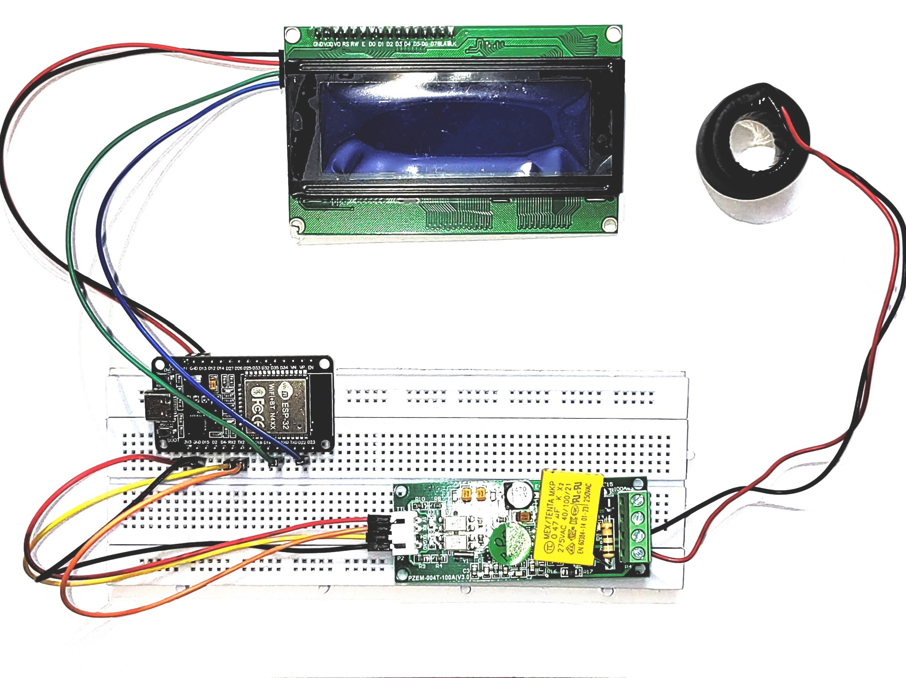
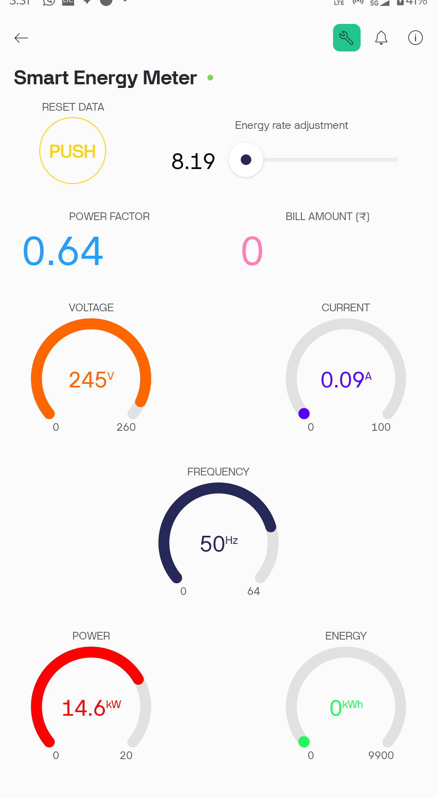
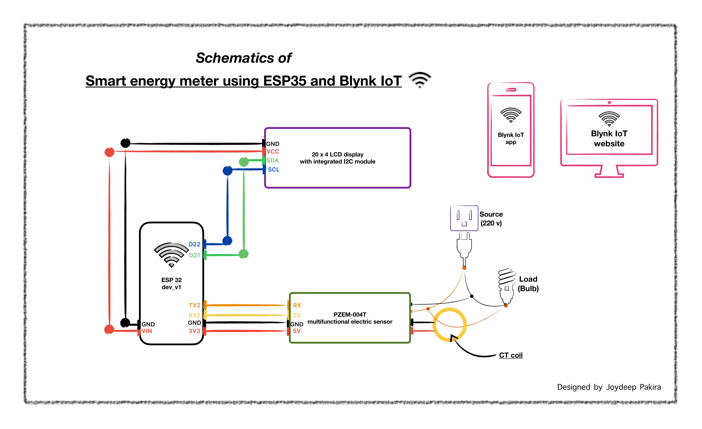

<h1 align="center">🔌 Smart Energy Meter with Remote IoT Monitoring</h1>


<p align="center">

&nbsp; 

</p>


<p align="center">

&nbsp; <b>Built with ESP32 + PZEM-004T + Blynk</b>  

&nbsp; <br/>

&nbsp; <i>A solo-engineered embedded systems project for real-time power monitoring</i>

</p>


---


⚡ Project Overview


The **Smart Energy Meter** is a compact embedded system that uses an **ESP32 microcontroller** and **PZEM-004T multifunctional electric sensor** to measure *real-time voltage, current, power, and energy consumption*. The data is pushed to the **Blynk IoT platform** for wireless remote monitoring via a mobile dashboard and web app.


> 🎯 This project was built entirely solo as part of my self-driven journey into Embedded Systems \& IoT.


---


<h3>🧠 Tech Stack \& Components</h3>


<table>
  <thead>
    <tr>
      <th>Category</th>
      <th>Tools / Hardware</th>
    </tr>
  </thead>
  <tbody>
    <tr>
      <td>Microcontroller</td>
      <td>ESP32 Wi-Fi Module</td>
    </tr>
    <tr>
      <td>Energy Sensor</td>
      <td>PZEM-004T (v3.0)</td>
    </tr>
    <tr>
      <td>IoT Platform</td>
      <td>Blynk (mobile app)</td>
    </tr>
    <tr>
      <td>IDE</td>
      <td>Arduino IDE</td>
    </tr>
    <tr>
      <td>Communication</td>
      <td>UART (Serial)</td>
    </tr>
    <tr>
      <td>Version Control</td>
      <td>Git + GitHub</td>
    </tr>
  </tbody>
</table>


---


<h3>🏗️ Features</h3>


\- 📈 Real-time measurement of voltage, current, power, and total energy used

\- 📲 Wireless data transmission to Blynk app

\- 💡 Mobile dashboard interface with live values

\- ⚙️ Modular and readable code

\- 🧠 Designed with scalability (e.g., relay control or cloud logging)


---


<h3>🖼️ Project Media</h3>


<p float="left">

&nbsp; 

&nbsp; 

</p>


---


<h3>🛠️ Circuit Schematic</h3>


<p align="center">

&nbsp; 

</p>


\*\*Wiring Summary:\*\*

\- 🟢 PZEM-004T → TX/RX to ESP32 UART2 (GPIO 16 \& 17 recommended)

\- 🔵 ESP32 → Powered by 5V

\- ⚫ Sensor → CT coil and mains voltage input as per spec

\- 📡 ESP32 connects to Wi-Fi and transmits data to Blynk cloud


---


<h1 align="center">⚡ Smart Energy Monitor using ESP32 + PZEM-004T + Blynk</h1>

<h3 align="center">

&nbsp; 🔌 *Real-time Power Monitoring* • 📲 *Mobile Dashboard* • ☁️ *IoT Integration*

</h3>


---


<h3>🚀 How It Works (Workflow)</h3>

<table>

 <tr>

<th>Step</th><th>Description</th>

</tr>

<tr>

<td>🔌 ESP32 UART Setup</td>

<td>Initializes UART communication with the PZEM-004T sensor.</td>

</tr>

<tr>

<td>⚡ Sensor Reads Data</td>

 <td>Measures Voltage, Current, Power, and Energy from the connected load.</td>

</tr>

<tr>

<td>📡 Wi-Fi Transmission</td>

<td>ESP32 connects to Wi-Fi and transmits live data to the Blynk cloud server.</td>

</tr>

<tr>

<td>📲 Mobile Dashboard</td>

<td>Displays data in real time via the Blynk mobile application.</td>

</tr>

</table>


---


<h3>🔒 Security & Safety Notes</h3>

<table>
  <thead>
    <tr>
      <th>⚠️ Concern</th>
      <th>🔍 Details</th>
    </tr>
  </thead>
  <tbody>
    <tr>
      <td>🛡️ Authentication</td>
      <td>No user authentication – Blynk token is hardcoded.</td>
    </tr>
    <tr>
      <td>⚡ Mains Voltage Risk</td>
      <td>Not safe for direct mains usage without proper insulation &amp; isolation.</td>
    </tr>
    <tr>
      <td>🎓 Usage Type</td>
      <td><strong>Strictly for educational/demo purposes.</strong> Not production-grade.</td>
    </tr>
  </tbody>
</table>


---


<h3>🧩 Future Improvements</h3>

<table>
  <thead>
    <tr>
      <th>💡 Feature</th>
      <th>📌 Purpose</th>
    </tr>
  </thead>
  <tbody>
    <tr>
      <td>☁️ Cloud Sync</td>
      <td>Integrate with Firebase, ThingSpeak, or MQTT for analytics &amp; remote access</td>
    </tr>
    <tr>
      <td>🔌 Remote Relay Control</td>
      <td>Cut off power to load using Blynk app + Relay module</td>
    </tr>
    <tr>
      <td>📊 Data Logging</td>
      <td>Log data locally to SD card or sync to Google Sheets API</td>
    </tr>
    <tr>
      <td>📤 Offline Backup</td>
      <td>Add EEPROM or local storage fallback for Wi-Fi dropouts</td>
    </tr>
  </tbody>
</table>


---


<h2>🧠 What I Learned</h2>

<table>
  <thead>
    <tr>
      <th>🛠️ Area</th>
      <th>📘 Skills Gained</th>
    </tr>
  </thead>
  <tbody>
    <tr>
      <td>🔧 Embedded Communication</td>
      <td>UART protocol with energy meter (PZEM)</td>
    </tr>
    <tr>
      <td>⚙️ Sensor Integration</td>
      <td>Real-time data handling, parsing, and calibration</td>
    </tr>
    <tr>
      <td>🌐 IoT Networking</td>
      <td>Blynk setup, Wi-Fi config, and mobile dashboard deployment</td>
    </tr>
    <tr>
      <td>🔗 GitHub Versioning</td>
      <td>Structured commits, branch management, and clean documentation</td>
    </tr>
    <tr>
      <td>📝 Technical Writing</td>
      <td>Recruiter-ready README &amp; project explanations</td>
    </tr>
  </tbody>
</table>


---


<h3>⚙️ How to the run this project</h3>


\- 1. Clone the repo: git clone https://github.com/Pakira-J/Smart-energy-meter_IoT.git

\- 2. Open firmware /in Arduino IDE

\- 3. Install official board manager for ESP32 by Espressif systems

\- 4. Install required libraries:
    	\- Blynk
    	\- LiquidCrystal_I2C
    	\- PZEM004T

\- 5. Configure your Wi-Fi SSID and Blynk Auth Token in the code

\- 6. Upload to ESP32

\- 7. Monitor power on your phone via the Blynk app


---


<h1 align="center"> <b>Built with 💻, 📱, and 🔌 by Joydeep Pakira</b> <br/> <a href="https://www.linkedin.com/in/pakira-joydeep/">🔗 Connect on LinkedIn</a> | <a href="mailto:pakira.joydeep@gmail.com">📧 e-mail</a> </h1> ```


---


<h3>📂 Folder Structure</h3>


```bash

Smart-Energy-Meter-IoT/

├── smart\_energy\_meter/

│   └── smart\_energy\_meter.ino

├── Images/

│   ├── device\_real\_photo.jpg

│   └── mobile\_app\_screenshot.jpg

├── Schematics/

│   └── circuit\_diagram.pdf

├── README.md

└── LICENSE


